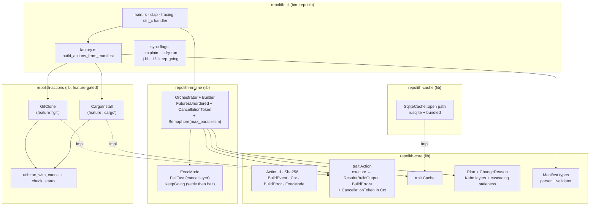
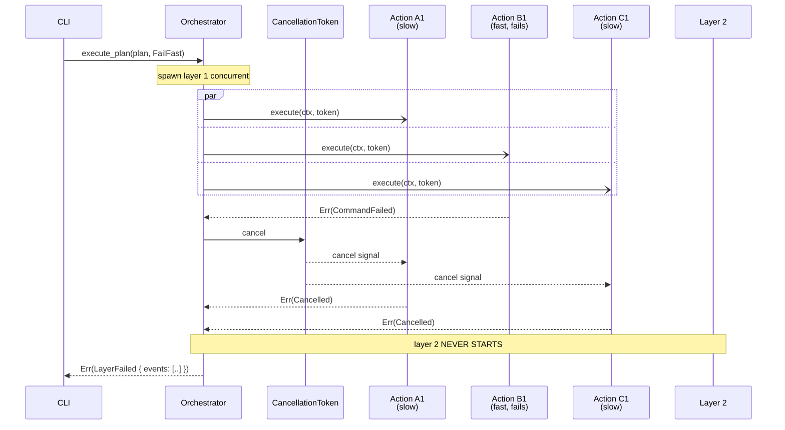
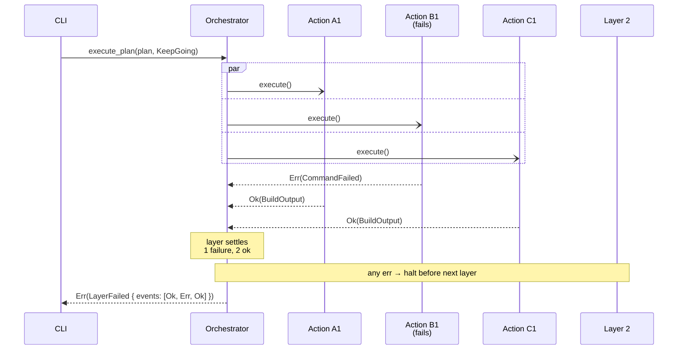

# Architecture

`repolith` is a 5-crate workspace. The split follows a strict
foundation → runtime layering: `repolith-core` is a pure
types/traits crate with no async runtime dependencies, and the
async machinery (`tokio`, `futures`, cancellation primitives) lives
one layer up in `repolith-engine`.

## Crate graph

## Sequence — `ExecMode::FailFast` (mid-layer cancel)

The orchestrator never uses `tokio::join_all`: that would defeat
cancellation by waiting for every future. Instead each layer runs
inside a `FuturesUnordered`, polled with `next().await`; on the
first `Err`, the shared layer-scoped `CancellationToken` is fired
and every action sees the cancel on its next `.await`.

## Sequence — `ExecMode::KeepGoing` (settle then halt)

Each action of the current layer runs to completion regardless of
peer failures. The orchestrator halts at the **layer boundary** if
anything in that layer failed — useful for surfacing every failure
in one run instead of bailing on the first one.

## Design decisions

These four shaped the M1 layout. They're locked in for v0.x; revisit
when concrete pressure (a second backend, a measured perf wall, etc.)
appears.

### `Cache` trait lives in `repolith-core`

`Plan::compute` consumes `&dyn Cache`. The trait sits in `core` so
both `repolith-engine` (which calls `Plan::compute`) and
`repolith-cache` (which implements the trait) can depend on it
without a cycle. Concrete backends — `SqliteCache` today, more
later — live in `repolith-cache`.

This mirrors `serde::Serialize` defined in `serde` with
implementations in dependent crates.

### Async runtime in `repolith-engine`, not `repolith-core`

`repolith-core` is a pure types/traits crate with no `tokio` or
`futures` runtime dependency. The orchestrator and its plumbing
(`FuturesUnordered`, `Semaphore`, `CancellationToken`) live in
`repolith-engine`. Future consumers (TUI, LSP, telemetry) can pull
the lightweight `core` for parsing + plan computation, or add
`engine` when they actually need to execute.

Mirrors the ecosystem convention (`axum-core` / `axum`,
`tower` / `tower-http`).

### Never `tokio::join_all` for layer execution

`join_all` waits for every future to complete and ignores
cancellation, which would make `FailFast` meaningless.
`FuturesUnordered::next().await` in a loop is the only correct
primitive: the orchestrator can act on each completion as it lands
and fire `cancel.cancel()` immediately when the first error appears.

The `crates/repolith-engine/src/orchestrator.rs` doc comment carries
this as an invariant; PR review rejects any reintroduction of
`join_all` in execute paths.

### `BuildError` stored as JSON in the cache

`BuildEvent::Failed.error` is a typed `BuildError` enum (since
issue #2). The naive plan was to stringify it for the cache. Instead
we serialize via `serde_json` into the `error_json` SQLite column so
the typed variant + payload survive the roundtrip. A re-plan after a
failed run can therefore reason about *why* it failed without
re-parsing strings.

The cost is a tiny `serde_json` dep in `repolith-cache`. The benefit
is that downstream consumers (telemetry, retry policies, future
diagnostics) get structured failure data for free.

## Where things live, in one paragraph

The CLI (`crates/repolith-cli/src/main.rs`) parses flags with
`clap`, loads the manifest with `Manifest::from_toml`, builds the
action list via the local `factory.rs`, opens the cache, hands the
whole bundle to `Orchestrator::Builder`, and dispatches to
`compute_plan` / `execute_plan` / `status` rendering. The
orchestrator (`repolith-engine`) walks the plan layer by layer
through `FuturesUnordered`, persists each `BuildEvent` to the cache,
and propagates a single root `CancellationToken` (created in `main`,
fired by a `tokio::signal::ctrl_c()` handler) so `Ctrl-C` cancels
in-flight subprocesses cleanly.
