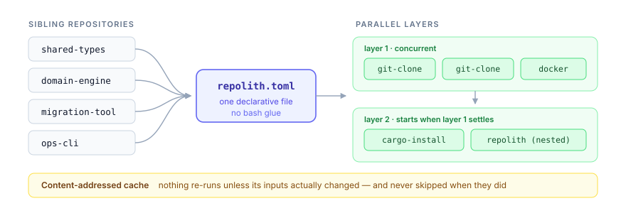
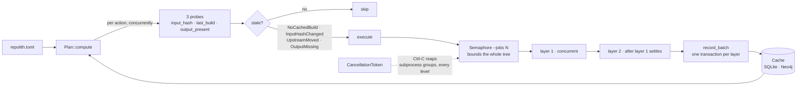

<div align="center">

# repolith

**Declarative orchestrator for Rust toolchains spread across multiple sibling git repositories.**

<picture>
  <source media="(prefers-color-scheme: dark)" srcset="assets/hero-dark.svg">
  
</picture>

⚡ Parallel · 🛑 Cancellation-aware · 💾 Cache-first

[](https://github.com/anatta-rs/repolith/actions/workflows/ci.yml)
[](#license)
[](https://www.rust-lang.org/)
[](https://crates.io/crates/repolith-cli)
[](CONTRIBUTING.md)

</div>

`repolith` reads one `repolith.toml` describing remote repositories and the
actions to run against them — `git clone`, `cargo install`, `docker build` — then
executes the plan in **parallel layers**, with **content-addressed caching**
so untouched work never re-runs and a shared **`CancellationToken`** so
`Ctrl-C` cleanly aborts every in-flight subprocess.

## What it looks like

Given a manifest:

```toml
[orchestrator]
schema_version = "0.1"
name = "my-stack"

[[node]]
id = "shared-types"
git = "https://github.com/example-org/shared-types"
path = "../libs/shared-types"
  [[node.action]]
  kind = "git-clone"

[[node]]
id = "migration-tool"
git = "https://github.com/example-org/migration-tool"
path = "../tools/migration-tool"
  [[node.action]]
  kind = "git-clone"
  [[node.action]]
  kind = "cargo-install"
  crate = "migrate"
  install_to = "~/.local/bin"
```

You preview, then sync:

```console
$ repolith status
+-------------------------------+--------+---------------+
| Action                        | Status | Reason        |
+===============================+========+===============+
| shared-types::git-clone::0    | stale  | NoCachedBuild |
| migration-tool::git-clone::0  | stale  | NoCachedBuild |
| migration-tool::cargo-install | stale  | NoCachedBuild |
+-------------------------------+--------+---------------+

$ repolith sync --dry-run --explain
• shared-types::git-clone::0: NoCachedBuild
• migration-tool::git-clone::0: NoCachedBuild
• migration-tool::cargo-install::1: NoCachedBuild
dry-run: 3 action(s) would run

$ repolith sync
OK   shared-types::git-clone::0 (55 ms)
OK   migration-tool::git-clone::0 (188 ms)
OK   migration-tool::cargo-install::1 (4.2 s)

$ repolith sync
up to date — 0 stale actions
```

The second `sync` is a **no-op** — the cache holds last-run input hashes
per action, so nothing re-runs unless something actually changed. What
counts as "changed": the upstream HEAD, the **content** of a local
`path` source (edits are seen even uncommitted), a cargo feature, the
toolchain, the build platform — or the artifact going missing from this
machine. That last one matters with a shared cache backend: another
machine having built something is not a reason to skip building it here.

## Why use it

- **One declarative file.** Everything your stack needs to bootstrap, in
  `repolith.toml`. No bash glue, no per-machine README dance.
- **Parallel by default.** `tokio::FuturesUnordered` + `Semaphore` cap
  concurrency at `--jobs N` (default = `num_cpus`). Layer N+1 starts only
  when layer N settles — typed dependencies, no race conditions.
- **Cancels cleanly.** A shared `CancellationToken` plumbed through every
  action's `Ctx`. First failure in `--fail-fast` (default) cancels in-flight
  peers; `--keep-going` lets the layer settle then halts. On Unix the
  subprocess process group is signalled (SIGTERM → grace → SIGKILL) so
  cargo's `rustc` / linker grandchildren get reaped too.
- **Cache-first, and honest about it.** Every successful build writes a
  `BuildEvent` keyed by a content-addressed input hash — for local `path`
  sources that means the tree's actual bytes (`.gitignore`-aware, `target/`
  excluded, mtimes ignored so a fresh clone doesn't look stale). For a
  workspace member it means more than its own directory: the hash follows
  `path` dependencies transitively and covers the workspace root manifest
  and lockfile, so editing a crate your binary is built from marks it stale.
  Before trusting a cache hit the planner also checks the artifact is still
  here. Re-runs are near-instant when nothing changed, and never skipped
  when something did.
- **Hardened argv.** URLs validated against a scheme allowlist with
  nested-userinfo / host / path-segment leading-dash checks; `--` argv
  separator before every user URL as defense in depth; crate names + feature
  flags rejected if they could break cargo's `--features` list.

## What it is NOT

The negative scope is **fixed** and will not evolve:

- **Not a CI runner** — no distributed execution, no remote workers.
- **Not a toolchain manager** — `rustup` is fine.
- **Not a package manager** — `cargo` is fine.
- **Not a process supervisor** — `systemd` / `launchd` / `docker compose`
  are fine; repolith reads heartbeats, doesn't write them.
- **Not a monorepo tool** — `cargo workspaces` already covers single-repo
  workspace publishing.
- **Not a hermetic build system** — hermeticity is opt-in per action, not
  the default.

## Quick start

```bash
# 1. Install the binary from crates.io
cargo install repolith-cli

# 2. Write a manifest in your stack root (see the reference below,
#    or start from repolith.toml.example)
mkdir -p ~/my-stack && cd ~/my-stack
$EDITOR repolith.toml

# 3. Preview what would happen
repolith sync --dry-run --explain

# 4. Go
repolith sync
```

Building from source works too: `git clone
https://github.com/anatta-rs/repolith && cargo build --release`.

`repolith status` prints a cache hit/miss table without running anything.
`repolith sync -k` keeps a layer running after a failure (useful for
surfacing every failure of a layer in one pass).

### Drilling into one action

The table has to keep every reason inside a cell, so it shows the first
line of an error capped at 72 characters. Pass any substring of an action
id to get the rest:

```bash
repolith status land              # every action of the `land` node
repolith status land::cargo       # just its cargo-install
```

```text
land::cargo-install::1
  state       stale
  reason      previous run failed: command failed (exit 101): error[E0308]…
  last run    failed in 3.4 s, 12 minutes ago
  error       command failed (exit 101): error[E0308]: mismatched types
                --> src/main.rs:1:26
                 |
               1 | fn main() { let x: i32 = "not an integer"; }
                 |                    ---   ^^^^^^^^^^^^^^^^ expected `i32`
  input       cached   e91d8f27811ed38c4e5508b3d02095b3e31235c59945e70c22…
              current  e91d8f27811ed38c4e5508b3d02095b3e31235c59945e70c22…
  deps        land::git-clone::0 (up-to-date)
  artifact    missing
  source      path /Users/you/projects/land
  action      cargo-install
  package     land
  profile     release (cargo default)
```

Action ids are `{node}::{kind}::{index}` and are stable — they are the
cache keys. A filter that matches nothing exits non-zero, so a typo is
never mistaken for a healthy action.

### Forcing a rebuild

The same filter drives `sync`, for when you want work to happen anyway:

```bash
repolith sync --force              # everything
repolith sync --force land         # just the `land` node
repolith sync --force --dry-run    # see what it would do first
```

Reach for it when you suspect the cache is wrong, or when an input exists
that repolith does not model — a system library, a rustc nightly rolling
forward, a `~/.cargo/config.toml` edit. It only ever causes *more* work,
never less, so it can't leave you with a stale artifact.

Whatever is built from a forced action re-runs too, via the normal
staleness cascade. One deliberate exception: a `kind = "repolith"` node
re-runs the coordinator but does **not** force the nested stack — otherwise
a targeted `--force` would quietly become a recursive rebuild of the whole
tree. To force a child stack, run `repolith sync --force` inside it.

See [`repolith.toml.example`](repolith.toml.example) for a full annotated
manifest.

## Manifest reference

A manifest is one `[orchestrator]` block plus any number of `[[node]]`
blocks; each node carries the actions to run against it, in order.

### `[orchestrator]`

| Field | Required | Description |
|---|---|---|
| `schema_version` | yes | Manifest schema. Current requirement: `~0.1` (e.g. `"0.1"`). |
| `name` | yes | Human-readable stack name, shown in logs. |

### `[[node]]`

| Field | Required | Description |
|---|---|---|
| `id` | yes | Unique node id. Also the default crate name for `cargo-install`, and the prefix of every action id (`{id}::{kind}::{index}`). |
| `git` | per action | Source URL (`https://`, `ssh://`, or `git@host:path`). **Source** for `git-clone`. |
| `path` | per action | Local checkout directory, relative to the manifest. **Destination** for `git-clone`, **source tree** for `cargo-install`. |

### Action kinds

**`kind = "git-clone"`** — fetch the node's source into `path`. No fields of
its own:

```toml
[[node.action]]
kind = "git-clone"
```

**`kind = "cargo-install"`** — `cargo install` from the node's source tree.
Every field is optional:

```toml
[[node.action]]
kind = "cargo-install"
crate = "migrate"              # default: the node's `id` — the BINARY name
package = "migration-tools"    # default: none — see below
profile = "dev"                # default: none → cargo's default, release
features = ["postgres", "tls"] # default: none
install_to = "~/.local/bin"    # default: ~/.repolith/bin (`~` expands at run time)
```

`crate` is the **binary target** name, which often differs from the package
that contains it (this repo installs the binary `repolith` from the package
`repolith-cli`).

`package` selects **which package** to build when the source holds more than
one — common for git repositories shipping test fixtures or a workspace of
tools, where cargo refuses to guess:

```
error: multiple packages with binaries found: …
Please specify a package, e.g. `cargo install --git <url> bin_only`
```

Leave it out unless you hit that error; omitting it lets cargo resolve on its
own, which is right for single-package sources.

`profile` picks the cargo profile (`--profile`) — `dev`, or any profile your
`Cargo.toml` defines. Useful for keeping debug symbols, or for a custom
profile such as one with thin LTO.

Do not expect a large build-time win from `dev`. Measured on this repository,
cold and without a compiler cache: **26.8 s release against 25.0 s dev — 7 %**,
for a binary **3.5× larger** (11 MB → 39 MB) and **1.8× more** build
artifacts. Crates whose build is dominated by optimisation will differ; many
are dominated by C dependencies and proc macros, which the profile does not
touch. Measure before assuming.

Switching profiles re-installs: the profile is part of the input hash, since
both land the binary at the same path and nothing else could tell them apart.

**`kind = "docker"`** — `docker build` an image from the node's checkout
(build-only: running containers stays out of scope, see
[What it is NOT](#what-it-is-not)). Requires `path` on the node; `tag` is
the only required field:

```toml
[[node.action]]
kind = "docker"
tag = "my-org/app:latest"      # required — docker reference charset only
dockerfile = "build/Dockerfile" # default: Dockerfile (relative to context)
context = "build"              # default: the node's `path`
```

`dockerfile` and `context` must stay inside the node's checkout: relative
paths only, no `..`, validated at parse time and re-checked after symlink
resolution at build time.

**`kind = "repolith"`** — federation: the node's checkout contains its own
`repolith.toml`, executed as a nested plan (orchestrator-of-orchestrators).
Requires `path` on the node; the one field is optional:

```toml
[[node.action]]
kind = "repolith"
manifest = "repolith.toml"     # default — relative to the node's `path`
```

The child stack keeps its **own local cache**
(`<stack>/.repolith/cache.db`), exactly as if you had run `repolith sync`
in that directory. Guard rails: manifest cycles (`A -> B -> A`) are
rejected with the offending chain, federation depth is capped at 8,
`--jobs N` bounds the **whole tree** (one global pool, never N per level),
and Ctrl-C cancels every level down to the subprocess groups. The
`manifest` path obeys the same two-stage containment as docker's paths.

Actions on the same node run **in declaration order**; independent nodes run
**in parallel**.

## Published version vs working copy

Two things you may want from the same stack: install what is **released**, or
install what you are **editing right now**. repolith has no `--dev` flag for
this — the distinction is which manifest you name, so it stays visible at the
call site instead of hidden in a mode:

```bash
repolith sync                                 # ./repolith.toml — the published thing
repolith sync --manifest repolith.dev.toml    # your working copy, debug build
```

This repository ships both as a worked example. The pair usually differs in
two places: `path` (a checkout repolith owns, versus your workspace) and
`profile` (release versus `dev`). Switching between them rebuilds once —
expected, since the profile is part of the input hash.

One trap worth stating: a node with a `git-clone` action **resets its
checkout** (`git fetch` + `git reset --hard`). Never point such a node at a
directory you work in; keep those under something like `~/.repolith/src` and
let the dev manifest be the one that reads your workspace.

## Faster rebuilds with sccache

repolith runs `cargo install`, and cargo builds each install in a throwaway
directory — so nothing is reused between syncs out of the box. A shared
compiler cache fixes that, and the difference is not subtle. Measured on a
small binary crate: **7.4 s cold, 1.1 s warm**.

[sccache](https://github.com/mozilla/sccache) is the simplest way there:

```bash
cargo install sccache --locked
```

```toml
# ~/.cargo/config.toml — applies to every cargo invocation, repolith included
[build]
rustc-wrapper = "sccache"

# sccache cannot cache incremental compilation; leave it off or it silently
# stops helping.
[profile.dev]
incremental = false
```

Cap the cache so it cannot grow without bound (`SCCACHE_CACHE_SIZE="10G"`),
and know the limits before expecting miracles: crates with procedural macros
are not cacheable, so the Rust hit rate is always partial. `sccache
--show-stats` reports per-server-session counters that reset when the server
idles out — the on-disk cache survives, only the numbers restart.

## Cache backends

The build cache is pluggable (`Cache` trait in `repolith-core`). Two
backends ship today; `--cache` (or `REPOLITH_CACHE`) selects one:

| Backend | Select with | Storage | When |
|---|---|---|---|
| `sqlite` *(default)* | — | local file, `~/.repolith/cache.db` (`--cache-path`) | single machine — zero config |
| `neo4j` | `--cache neo4j` | shared server, build events as graph data | multi-machine / federated stacks |

The Neo4j backend reads `REPOLITH_NEO4J_URI`, `REPOLITH_NEO4J_USER`, and
`REPOLITH_NEO4J_PASS` from the environment — credentials never live in
`repolith.toml`, and these variables are never forwarded to spawned
subprocesses. Schema: one `(:Action {id})` node per action with a `LAST`
relationship to its most recent `(:BuildEvent)`; layer writes are one
transaction. `NamespacedCache` (library-level) lets multiple stacks share
one server without id collisions.

## Architecture

5 crates, layered execution with `FuturesUnordered` + `CancellationToken` +
`Semaphore`. Full diagram + the `FailFast` / `KeepGoing` sequence diagrams
+ design decisions live in [`ARCHITECTURE.md`](ARCHITECTURE.md).

How one `sync` flows:



Every action declares its own `input_hash`, so staleness is decided from
content rather than timestamps — and `output_present` means a cache entry
written by another machine never lets this one skip work it has not done.

| Crate | Purpose |
|---|---|
| [`repolith-core`](https://crates.io/crates/repolith-core) | Types, traits (`Action`, `Cache`), manifest parser, layered `Plan`. |
| [`repolith-cache`](https://crates.io/crates/repolith-cache) | `SqliteCache` (rusqlite, bundled, WAL), `Neo4jCache` (feature `neo4j`), `NamespacedCache`. |
| [`repolith-engine`](https://crates.io/crates/repolith-engine) | Async `Orchestrator` with cancellation + semaphore. |
| [`repolith-actions`](https://crates.io/crates/repolith-actions) | `GitClone` (feature `git`), `CargoInstall` (feature `cargo`), `DockerBuild` (feature `docker`). |
| [`repolith-cli`](https://crates.io/crates/repolith-cli) | `repolith sync / status` — the binary you run. |

## Status

**M2 complete.** 5 crates, 4 action kinds (`git-clone`, `cargo-install`,
`docker`, `repolith` federation), 2 cache backends (`SQLite` default,
Neo4j opt-in with a live-server contract suite in CI), parallel layered
execution with tree-wide cancellation, URL-injection + path-traversal
hardening. Full test suite under
`cargo test --workspace --all-features` (110+ tests at last count). The
crates.io badge above always shows the current published version; see
[`CHANGELOG.md`](CHANGELOG.md) for the per-release breakdown. All 5
crates are published on
[crates.io](https://crates.io/crates/repolith-cli); releases are automated
with [release-plz](https://release-plz.dev) — merging the release PR
publishes, tags, and cuts the GitHub Release.

### Roadmap

- **M2** — ✅ complete: `docker` action, federation `kind = "repolith"`,
  Neo4j cache backend.
- **M3** — watch mode (re-plan on file change), `template_apply` action
  driving `AttachedEntry::Outbound`.

## Security

See [`SECURITY.md`](SECURITY.md) for the threat model, the env-allowlist
policy, and the GitHub Security Advisories private-reporting form for
vulnerability disclosure.

## Contributing

PRs welcome. See [`CONTRIBUTING.md`](CONTRIBUTING.md) for the dev setup,
local CI gates, and worked recipes for adding a new action or a new cache
backend.

## License

Dual-licensed under either of:

- Apache License, Version 2.0 ([LICENSE-APACHE](LICENSE-APACHE))
- MIT license ([LICENSE-MIT](LICENSE-MIT))

at your option.
