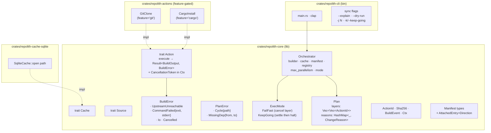
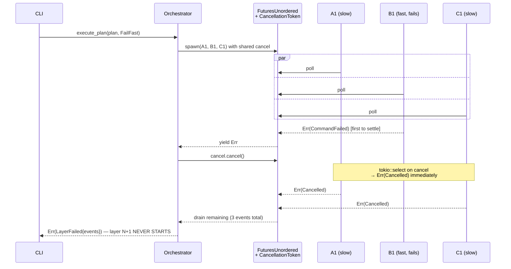

# repolith

> Multi-repo orchestration for Rust ecosystems. Lightweight. Graph-aware.

This crate name is **reserved on crates.io**. The real implementation is
incubating in [`anatta-rs/anatta`](https://github.com/anatta-rs/anatta)
and will land here once the API stabilizes (target: 0.1.0).

## What repolith will be

A declarative, content-addressed orchestrator for Rust projects spread
across multiple sibling git repositories. Three core concepts:

- **node** — a managed git repo (services, CLIs, libraries)
- **action** — one step of work (cargo install, docker compose, deploy
  templates, project artifacts into a graph, ...)
- **attached** — a consumer repo that pulls templates from the
  orchestrator (e.g. shared `.claude/` or `.githooks/` files)

Pluggable cache backends (sqlite default, Neo4j optional for projects
that want a queryable causal trace of every build).

## What repolith will NOT be

The negative scope is **fixed** and will not evolve:

- Not a CI runner — no distributed execution, no remote workers
- Not a toolchain manager — `rustup` is fine
- Not a package manager — `cargo` is fine
- Not a process supervisor — `systemd` / `launchd` / `docker compose`
  are fine; repolith reads heartbeats, doesn't write them
- Not a monorepo tool — `cargo workspaces` already covers single-repo
  workspace publishing
- Not a hermetic build system — hermeticity is opt-in per action, not
  the default

## Architecture (target — v0.1)

GDD-validated layout for milestone [v0.0.1 — bootstrap M1](https://github.com/anatta-rs/repolith/milestone/1).
4 crates, 3 traits, layered execution with `FuturesUnordered` + `CancellationToken`.

### Sequence — `repolith sync` with `ExecMode::FailFast`

Mid-layer cancellation via `FuturesUnordered` + shared `CancellationToken`
(NOT `tokio::join_all` — see [#6](https://github.com/anatta-rs/repolith/issues/6)).

## Status

`0.0.0` is a placeholder. Watch the GitHub repo for milestones.

## License

Dual-licensed under either of:

- Apache License, Version 2.0 ([LICENSE-APACHE](LICENSE-APACHE))
- MIT license ([LICENSE-MIT](LICENSE-MIT))

at your option.
